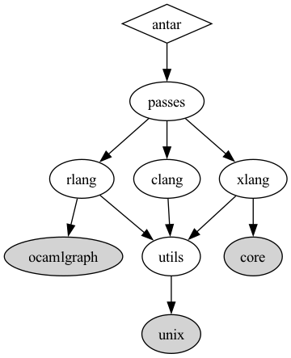

# Compiler course

* GitHub Gist: https://gist.github.com/camoy/522230d19f546b7f5994189482eab8db
* Course website: http://jeapostrophe.github.io/courses/2021/spring/406/course/

## `dune-deps` graph

[dune-deps GitHub source code](https://github.com/mjambon/dune-deps)

### Helpful links
* Dune project: https://medium.com/@bobbypriambodo/starting-an-ocaml-app-project-using-dune-d4f74e291de8

